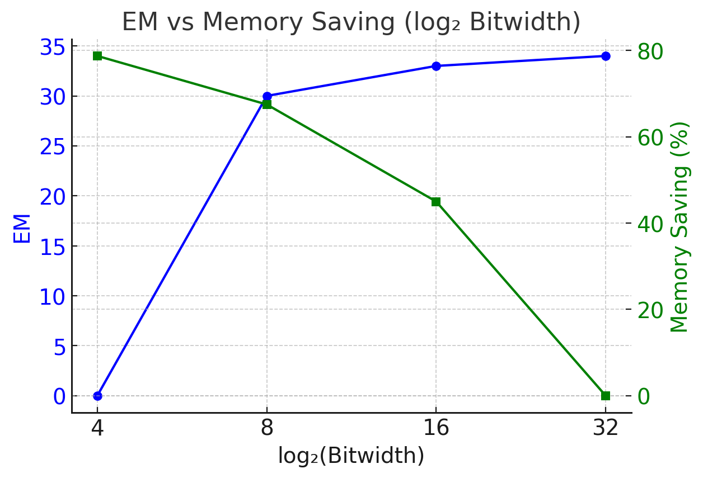
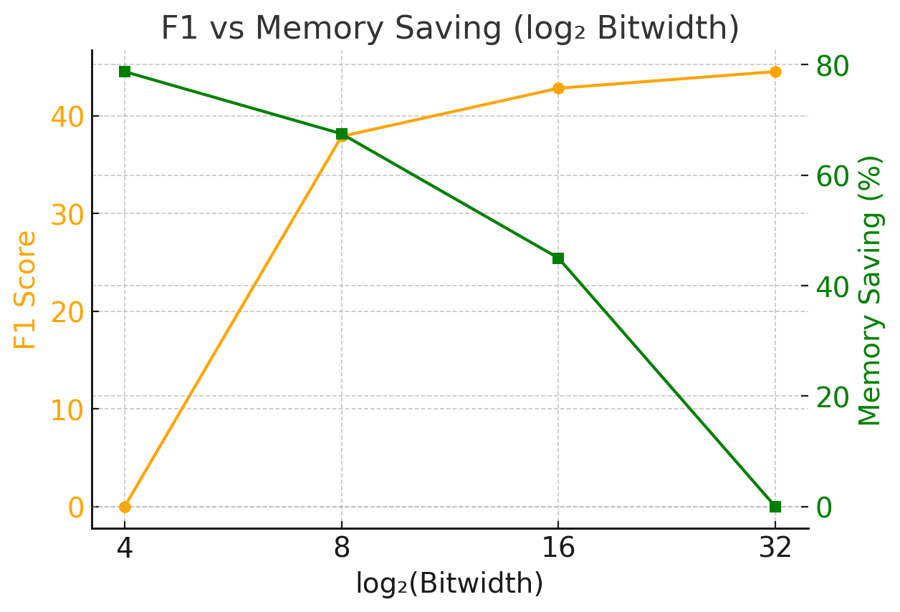
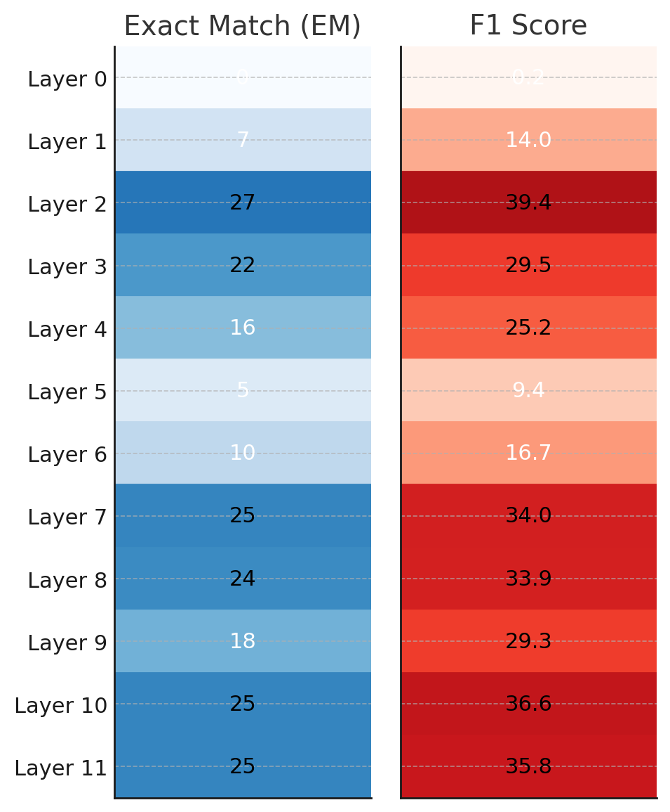
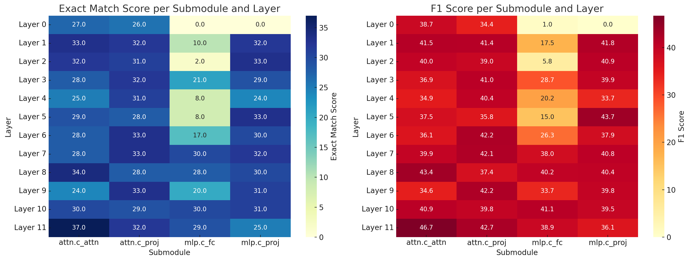
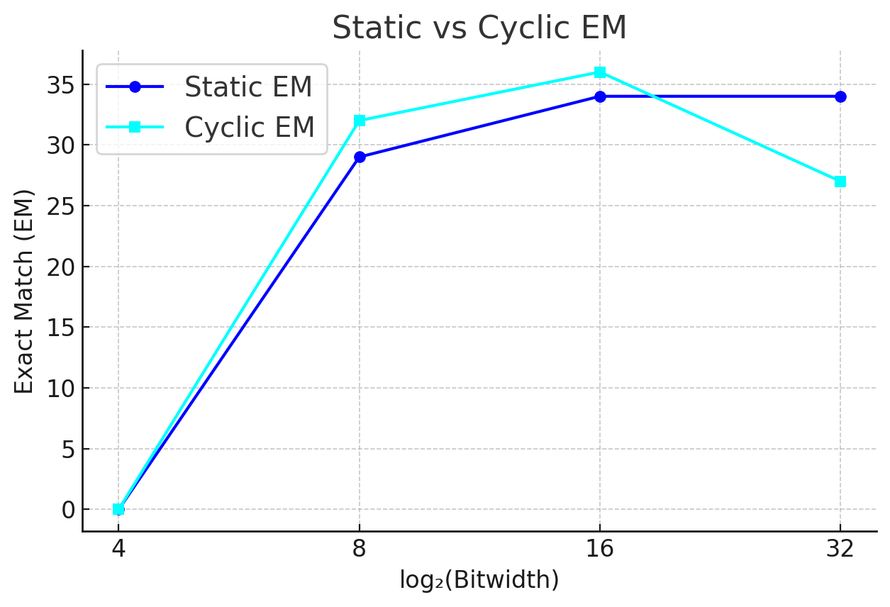
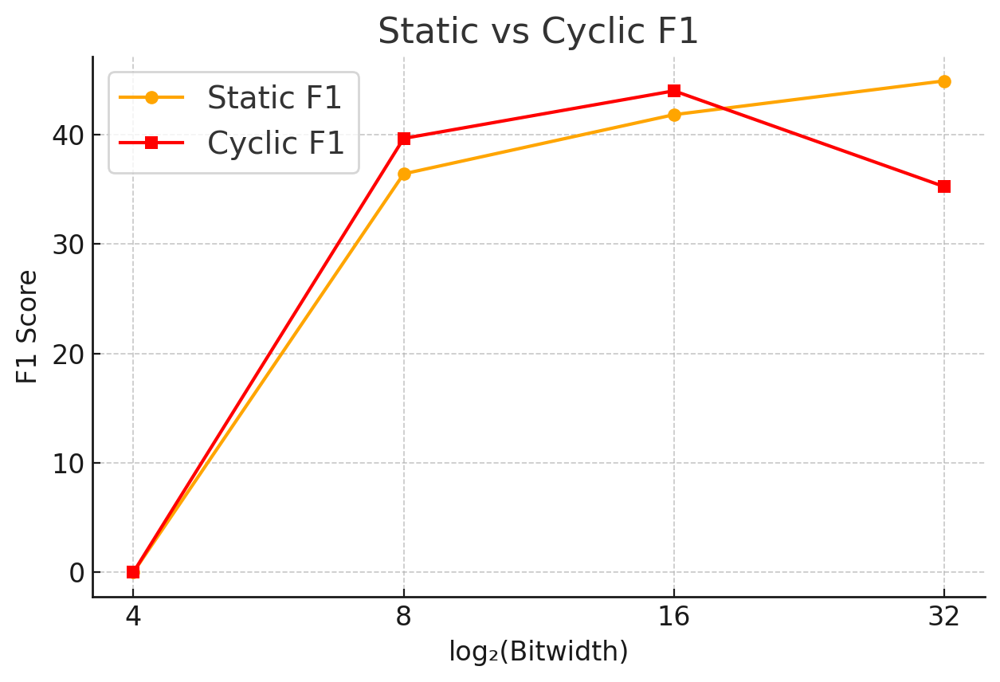
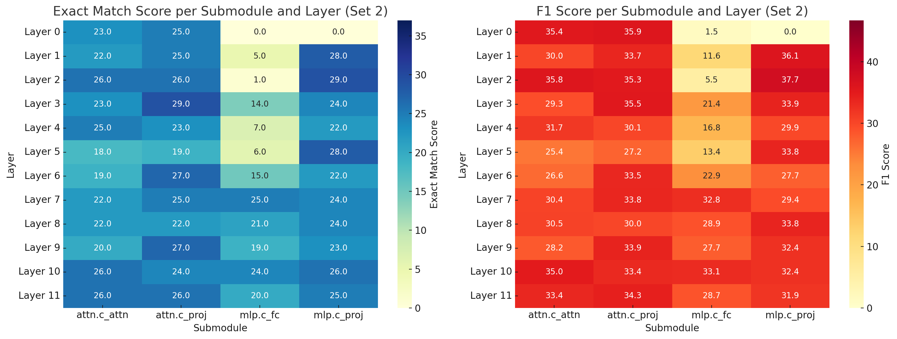
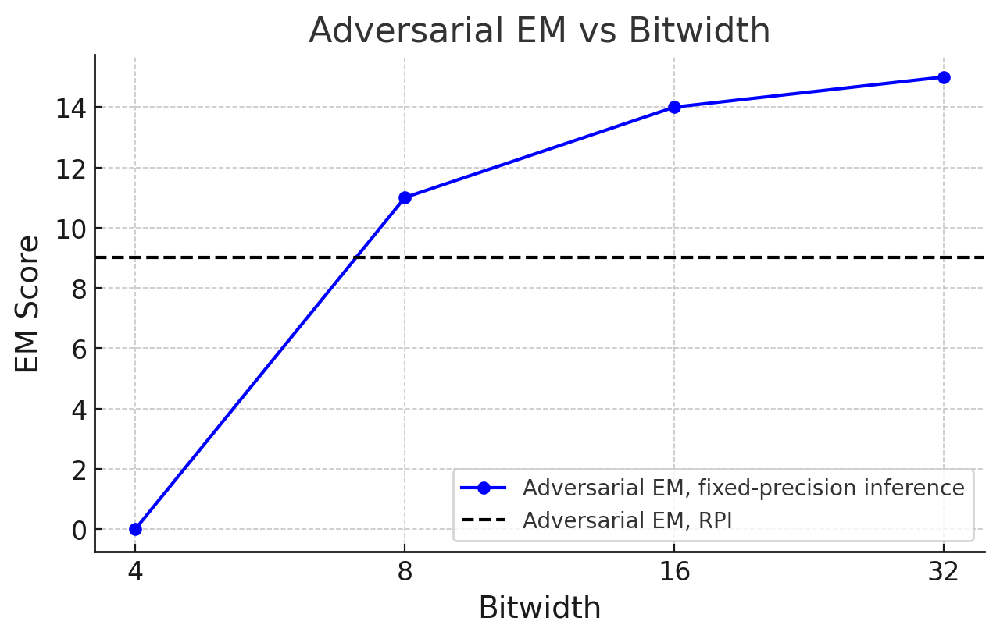
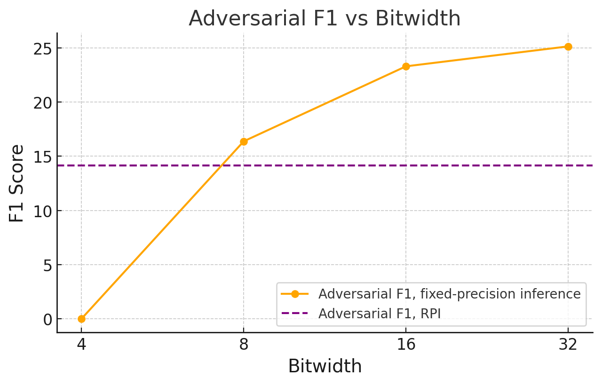

## Efficient LLMs via Switchable and Dynamic Quantization

### Overview
- The goal of this project is to use quantization-aware training (QAT) to improve the accuracy-efficiency tradeoff of causal large-language models at inference time. In addition, the robustness against adversarial attacks is evaluated with this training scheme.

### Code Structure

- training/qat.py: Quantization-aware training (QAT)
- eval/inference_trained_policy.py: Inference fine-tuned model
- attacks/prep_attack.py: generate attacked input
- Colab: 

### Deliverables

#### [Step 4] What is the task accuracy achieved after applying various quantization bit-width configurations to the SQuAD dataset?
Several methods were applied to evaluate the task accuaracy:
- <b>Uniform quantization</b>: Same bitwidth across all layers and submodules
- <b>Coarse, layer-wise quantization</b>: 12 layers total (h.0 - h.11)  
- <b>Fine-grained, submodule-wise quantization</b>: 48 submodules total = 4 submodules / layer x 12 layers = 48 submodules

Uniform quantization
- This simple quantization method provides us with high-level insights on quantization sensitivity.
- The best accuracy score of 34 and 44 (EM and F1, respectively) is achieved at 32-bit (full-precision).
- As we reduce the bitwidth, accuracy reduces while memory saving improves.
- The optimal point for accuracy-efficiency tradeoff is where the two curves cross each other at 8-bit. Using this configuration, we achieve substantial memory saving while maintaining close to full-precision task accuracy.
- In general, QAT allows for dynamic bitwidth configuration at inference time based on the desired accuracy and available compute resources.

  
  

Coarse, layer-wise quantization
- All layers are 32 bits by default, and one layer is switched to 4 bit at a time to determine the layer-wise quantization sensitivity

  

Fine-grained, submodule-wise quantization  
- All submodules are 32 bits by default, and one submodule is switched to 4 bit at a time to determine the layer-wise quantization sensitivity.

  

---

#### [Step 4] How did you determine the optimal quantization bit-width configurations? Have you gleaned any insights from your observations that could guide future work to further enhance performance?

Greedy quantization
- Default all submodules to 32 bits, then flip submodule by submodule to 4-bit, and stop when EM score <= 31 (10% hit on accuracy)  
- Final EM = , F1 =, Memory savings = %  
- Layers flipped to 4 bits:  
  - h.11.attn.c_attn

Observations & Insights
- Fine-grained, submodule-wise quantization outperforms coarse, layer-wise quantization due to the course method simultaneously quantizing all submodules regardless of their quantization sensitivity.
- From the course quantization experiment, we can see that:
  - All layers are pretty sensitive relative to the full-precision score of 34.
  - Layers 2, 7, 8, 10, 11 are relatively less sensitive (minimum of 7% performance hit).
  - Earlier transformer layers (especially layer 0) are more sensitive.
- From the fine quantization experiment, we can see that:
  - MLP submodules (especially c_fc) are more sensitive than attention layers.
  - Projection submodules are less sensitive.

---

#### [Step 4] A motivation behind switchable quantization is to support diverse layer-wise quantization configurations simultaneously, accommodating different resource allocation needs. Could you suggest additional training objectives that could more effectively facilitate the mechanism for switching quantization bit-widths?
- Specialized training for sensitive submodules: in my current (generic) QAT training, I set all layers to a uniform quantization. We could quantize only one or few sensitive layers and run additional training cycles with that.  
- Dropout training (similar conceptually but opposite of specialized training): quantize every layer except for a few dropout layers during trainning

---

#### [Step 5] Does this phenomenon align with the observations in CPT (ICLR’21)? If not, what could be the potential reasons?
- Instead of static training (4, 8, 16, 32, 4, 8, 16, 32, …) we perform CPT training (4, 8, 16, 32, 16, 8, 4, 8, 16, 32, …)  
- In the graphs below, we can see cyclic performs slightly better at 8 and 16-bit while performing worse at 32-bit. This is due to CPT having more training iterations at 8 and 16 bits for a given training window.

  
  

- The below heat map shows the  accuracy score achieved  using CPT. As can be shown, the scores are worse across the board compared to the static training used previously.

  

---

#### [Step 6] Does this phenomenon align with the observations in Double-Win Quant (ICML’21)? If not, what could be the potential reasons?
- In ICML’21, the authors found that  
  - Adversarial examples generated at one precision (e.g., 8-bit) often fail to transfer to the same model at a different precision (e.g., 4-bit), despite sharing weights.
  - Based on this, they proposed Random Precision Training (RPT) and Random Precision Inference (RPI) to improve adversarial robustness, achieving both robustness and efficiency — hence the “double win.”
  - RPT randomly selects a precision and applies it uniformly at each training step, whereas RPI randomly applies a uniform precision per prompt at inference time.
- Adversarial attack candidates  
  - PGD: Gradient-based vision model attacks used in ICML'21
  - LM-attack: dependency issues  
  - Textfooler: works only with LM’s with classification heads
  - Text-based: Replace common words with typos (selected for use in my experiment) 
- Below shows the accuracy scores after adversarial attack.  
  - The solid curve shows the accuracy scores under attack which degraded noticeably under attack (expected).
  - The dashed line shows the score with RPI enabled. The resulting accuracy score is somewhere between 4-bit and 8-bit precision.
  - This shows contrary findings compared to that shown in ICML'21. One possible explanation is that DWQ's defense is designed to break gradient-based attacks trained at a specific precision like PGD. In our case, the adversarail attack is text-based, which is not tied to a specific precision, reducing the robustness improvement from RPT or RPI. 

  
  

---

#### Based on your explorations of switchable and dynamic quantization, could you propose some promising research directions or questions for further integrating them with LLMs?
- My current implementation effectively trains different lora modules independently for different bit-width configurations. Modifying the loss function to become the average of the loss over all bit-widths may help the language model learn to generalize better and therefore achieve a higher accuracy score. Implementing teacher distillation by baking in the loss between 4-bit and 32-bit can also help to improve learning for the 4-bit configurations.
