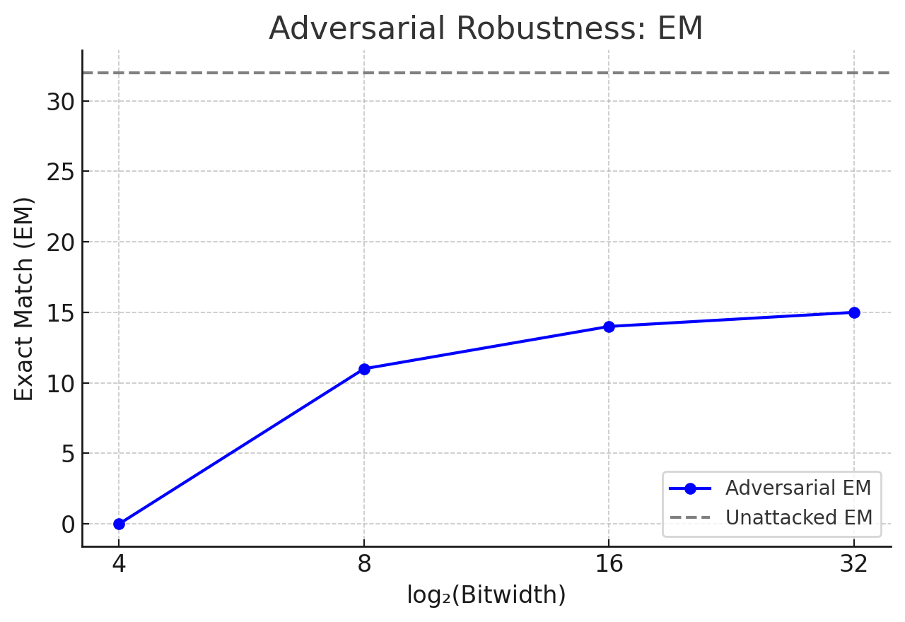
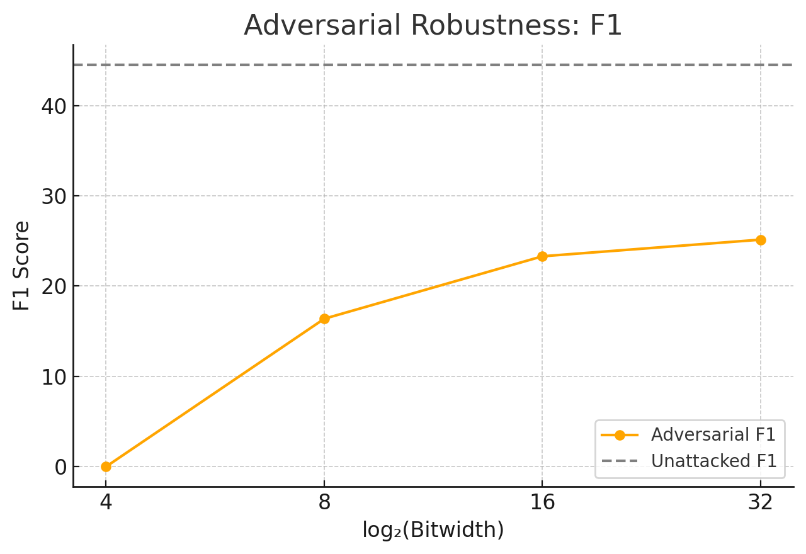

## Efficient LLMs via Switchable and Dynamic Quantization

### Overview

### Code Structure

### Deliverables

#### [Step 4] What is the task accuracy achieved after applying various quantization bit-width configurations to the SQuAD dataset?
- Uniform quantization shown below. In general, we can dynamically configure the bit-width based on the desired accuracy and available compute resources. 
- From the graphs below, the point where the accuracy and efficiency curves cross is the optimal bit-width configuration for accuracy-efficiency tradeoff. This allows for substantial memory savings while maintaining similar task accuracy

  
  

---

#### [Step 4] How did you determine the optimal quantization bit-width configurations? Have you gleaned any insights from your observations that could guide future work to further enhance performance?

##### Coarse, layer-wise quantization
- 12 layers total (h.0 - h.11)  
- All layers are 32 bits by default, and one layer is switched to 4 bit at a time to determine the layer-wise quantization sensitivity  
- All layers are pretty sensitive relative to the full-precision score of 34. This is due to the coarse layer-wise quantization that does not perform finer-grained submodule-wise quantization.  
- Layers 2, 7, 8, 10, 11 are relatively less sensitive, but note again that this course, layer-wise quantization results in a minimum of 7-point performance hit

  

##### Fine-grained, sub-module quantization
- 48 submodules total = 4 submodules / layer x 12 layers = 48 submodules  
- All submodules are 32 bits by default, and one submodule is switched to 4 bit at a time to determine the layer-wise quantization sensitivity

  

##### Greedy quantization
- Default all submodules to 32 bits, then flip submodule by submodule to 4-bit, and stop when EM score <= 31 (10% hit on accuracy)  
- Final EM = , F1 =, Memory savings = %  
- Layers flipped to 4 bits:  
  - h.11.attn.c_attn

---

#### [Step 4] A motivation behind switchable quantization is to support diverse layer-wise quantization configurations simultaneously, accommodating different resource allocation needs. Could you suggest additional training objectives that could more effectively facilitate the mechanism for switching quantization bit-widths?
- Specialized training for sensitive submodules: in my current (generic) QAT training, I set all layers to a uniform quantization. We could quantize only one or few sensitive layers and run additional training cycles with that.  
- Dropout training (similar conceptually but opposite of specialized training): quantize every layer except for a few dropout layers during trainning

---

#### [Step 5] Does this phenomenon align with the observations in CPT (ICLR’21)? If not, what could be the potential reasons?
- Instead of static training (4, 8, 16, 32, 4, 8, 16, 32, …) we perform CPT training (4, 8, 16, 32, 16, 8, 4, 8, 16, 32, …)  
- In the graphs below, we can see cyclic performs slightly better at 8 and 16-bit while performing worse at 32-bit. This is due to CPT having more training iterations at 8 and 16 bits for a given training window.  
- The below heat map shows the  accuracy score achieved  using CPT. As can be shown, the scores are worse across the board compared to the static training used previously.

  
  

---

#### [Step 6] Does this phenomenon align with the observations in Double-Win Quant (ICML’21)? If not, what could be the potential reasons?
- In ICML’21, the authors found that  
- Low-precision models (e.g. 8-bit) were more robust to adversarial perturbations than full-precision (32-bit) ones  
- The explanation was that quantization induces gradient masking or saturation, which makes it harder for attackers to find effective perturbations  
- Adversarial attack candidates  
  - Simple: Replace common words with typos (used in my experiment)  
  - LM-attack: dependency issues  
  - Textfooler: works only with LM’s with classification heads  
- Below shows the accuracy scores after adversarial attack.  
- The accuracy scores degraded significantly under attack. Interestingly though, the trend remained similar to previously unattacked scores  
- This could be due to differences between vision and language modeling.

  
  

---

#### Based on your explorations of switchable and dynamic quantization, could you propose some promising research directions or questions for further integrating them with LLMs?
- My current implementation effectively trains different lora modules independently for different bit-width configurations. Modifying the loss function to become the average of the loss over all bit-widths may help the language model learn to generalize better and therefore achieve a higher accuracy score. Implementing teacher distillation by baking in the loss between 4-bit and 32-bit can also help to improve learning for the 4-bit configurations.
