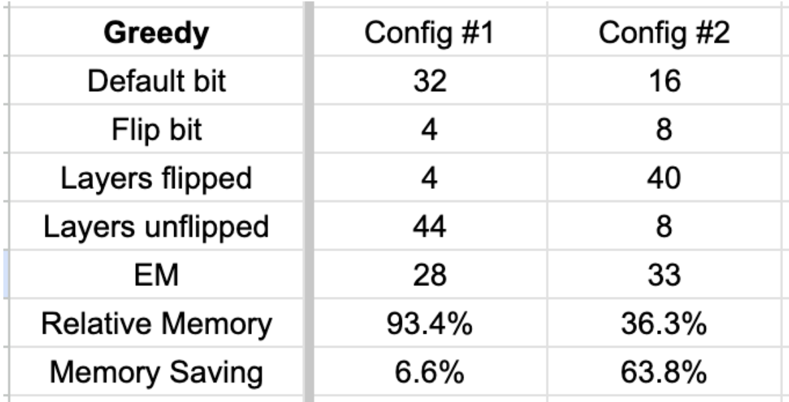

## Efficient LLMs via Switchable and Dynamic Quantization

### Overview
- The goal of this project is to apply quantization-aware training (QAT) to improve the accuracy-efficiency tradeoff of causal large-language models at inference time. Our best configuration achieves EM = 33 (vs. 34 full-precision) with 36.3% memory savings. In addition, we evalauate the robustness against adversarial attacks under different precision schemes.

### Code Structure

- training/qat.py: Implements quantization-aware training (QAT)
- eval/inference_trained_policy.py: Runsinference on the fine-tuned model
- attacks/prep_attack.py: Generates adversarially perturbed inputs
- Colab: 

### Deliverables

#### [Step 4] What is the task accuracy achieved after applying various quantization bit-width configurations to the SQuAD dataset?
We evaluate model performance under three granularity levels of quantization control::
- <b>Uniform quantization</b>: Same bitwidth across all layers and submodules
- <b>Coarse, layer-wise quantization</b>: 12 layers total (h.0 - h.11)  
- <b>Fine-grained, submodule-wise quantization</b>: 48 submodules total = 4 submodules / layer x 12 layers = 48 submodules

Uniform quantization
- This simple quantization method provides us with high-level insights on quantization sensitivity.
- The best accuracy score of 34 and 44 (EM and F1, respectively) is achieved at 32-bit. This score is also used as the full-precision reference.
- As we reduce the bitwidth, accuracy reduces while memory saving improves.
- The optimal point for accuracy-efficiency tradeoff is where the two curves cross each other at 8-bit. Using this configuration, we achieve substantial memory saving while maintaining close to full-precision task accuracy.
- In general, QAT allows for dynamic bitwidth configuration at inference time based on the desired accuracy and available compute resources.

  
  

Coarse, layer-wise quantization
- All layers are 32 bits by default, and one layer is switched to 4 bit at a time to determine the layer-wise quantization sensitivity

  

Fine-grained, submodule-wise quantization  
- All submodules are 32 bits by default, and one submodule is switched to 4 bit at a time to determine the layer-wise quantization sensitivity.

  

---

#### [Step 4] How did you determine the optimal quantization bit-width configurations? Have you gleaned any insights from your observations that could guide future work to further enhance performance?

To determine optimal bit-widths, we use a *greedy inference* strategy that incrementally reduces precision while monitoring task accuracy. Two configurations were evaluated:
- <b>Greedy Config #1</b>:
  - Default to 32 bits, then cumulatively flip each submodule to 4-bit. If score >=28, keep the flip, otherwise unflip back to 32.
  - Submodules are flipped in descending order, starting from the least sensitive (transformer.h.11.attn.c_attn shown in the heatmap above) to the most sensitive.
  - Final EM = 28, Memory savings = 6.6%  
- <b>Greedy Config #2</b>:
  - Default to 16 bits, then cumulatively flip each submodule (from least sensitive to most sensitive) to 8-bit. If score >=32, keep the flip, otherwise unflip back to 16.
  - Final EM = 33, Memory savings = 36.3%  

  

 

Observations & Insights
- Fine-grained, submodule-wise quantization outperforms coarse, layer-wise quantization due to the course method simultaneously quantizing all submodules regardless of their quantization sensitivity.
- From the course quantization experiment, we can see that:
  - All layers are pretty sensitive relative to the full-precision score of 34.
  - Layers 2, 7, 8, 10, 11 are relatively less sensitive (minimum of 7% performance hit).
  - Earlier transformer layers (especially layer 0) are more sensitive.
- From the fine quantization experiment, we can see that:
  - MLP submodules (especially c_fc) are more sensitive than attention layers.
  - Projection submodules are less sensitive.
- <b>Greedy config #2</b> achieves a strong balance between accuracy (EM = 33) and efficiency (36.3% memory savings).

---

#### [Step 4] A motivation behind switchable quantization is to support diverse layer-wise quantization configurations simultaneously, accommodating different resource allocation needs. Could you suggest additional training objectives that could more effectively facilitate the mechanism for switching quantization bit-widths?
- Specialized training: Focus the training effort on one or more sensitive layers to improve low-precision performance. This contrasts with the current QAT scheme, which applies uniform precision across all layers. 
- Stochastic dropout-style training: Randomly hold out one or more layers from quantization during each training step to encourage robustness to bit-width variation.

---

#### [Step 5] Does this phenomenon align with the observations in CPT (ICLR’21)? If not, what could be the potential reasons?
- In ICLR'21, the authors changed the training precision in a cyclical (sawtooth) manner and observed higher accuracy. CPT mimics cyclical learning rates that achieves the balance between exploration (low precision) and convergence (high precision). 
- To determine whether same phenomenon applies to our experiment, we perform CPT (4, 8, 16, 32, 16, 8, 4, 8, 16, 32, …) instead of static training (4, 8, 16, 32, 4, 8, 16, 32, …).
- From the graphs below, we observe that CPT slightly improves the performance at mid-precision (8 and 16-bit) while exhibiting lower scores at 32-bit. This is due to CPT having more training iterations at 8 and 16 bits for a given training window.

  
  

- The heatmap below shows the  accuracy score achieved  using CPT. As can be shown, the scores are worse across the board compared to the static training used previously.

  

Our results diverge from CPT (ICLR’21), which showed accuracy gains from cyclic precision schedules. In contrast, we observed a degradation in task accuracy when applying CPT to GPT-2 on SQuAD.

Potential reasons include:
- The original CPT was developed for CNNs and encoder-style Transformers, while our model is a large causal LLM.
- Our training setup uses shared embedding and language model head layers across different bitwidths. This contrasts with CPT where the authors used independent model weights.

---

#### [Step 6] Does this phenomenon align with the observations in Double-Win Quant (ICML’21)? If not, what could be the potential reasons?
- In ICML’21, the authors found that  
  - Adversarial examples generated at one precision (e.g., 8-bit) often fail to transfer to the same model at a different precision (e.g., 4-bit), despite sharing weights.
  - Based on this, they proposed Random Precision Training (RPT) and Random Precision Inference (RPI) to improve adversarial robustness, achieving both robustness and efficiency — hence the “double win.”
  - RPT randomly selects a precision and applies it uniformly at each training step, whereas RPI randomly applies a uniform precision per prompt at inference time.
- Adversarial attack candidates  
  - PGD: Gradient-based vision model attacks used in ICML'21
  - LM-attack: dependency issues  
  - Textfooler: works only with LM’s with classification heads
  - Text-based: Replace common words with typos (selected for use in my experiment) 
- The graphs below shows the accuracy scores after adversarial attack:  
  - The solid curve shows the accuracy scores with fixed-precision inference, whereas the dashed line shows the score with random-precision inference. The resulting accuracy score with RPI enabled is somewhere between 4-bit and 8-bit precision.
  - Our experiment diverges from DWQ in both attack type and quantization strategy. DWQ observed strong robustness gains due to precision-specific gradient attacks (e.g., PGD), while our text-based perturbation attack is not precision-specific, likely reducing the effectiveness of RPI.

  
  

---

#### Based on your explorations of switchable and dynamic quantization, could you propose some promising research directions or questions for further integrating them with LLMs?
- Train LoRA modules jointly using a unified loss over all target bit-widths
- Introduce cross-bitwidth distillation loss (e.g., 32-bit teacher supervising 4-bit)
- Create a gradient-based, causal-LM adversarial attack to evaluate whether the robustness improves with QAT training
